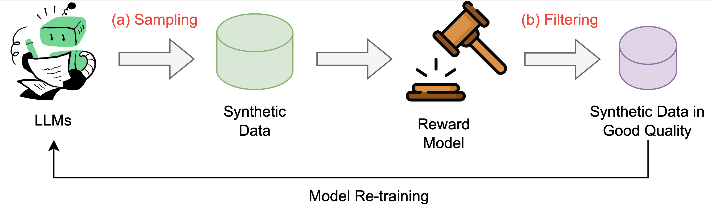
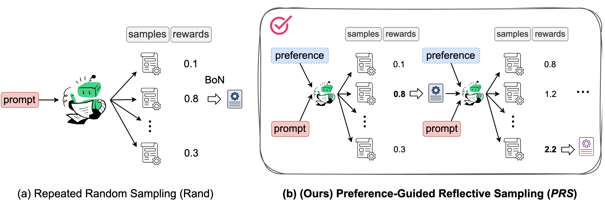
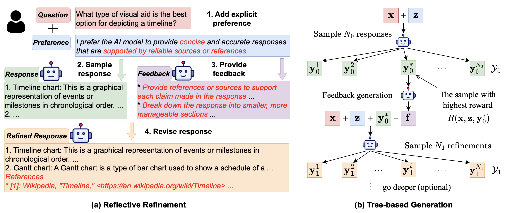
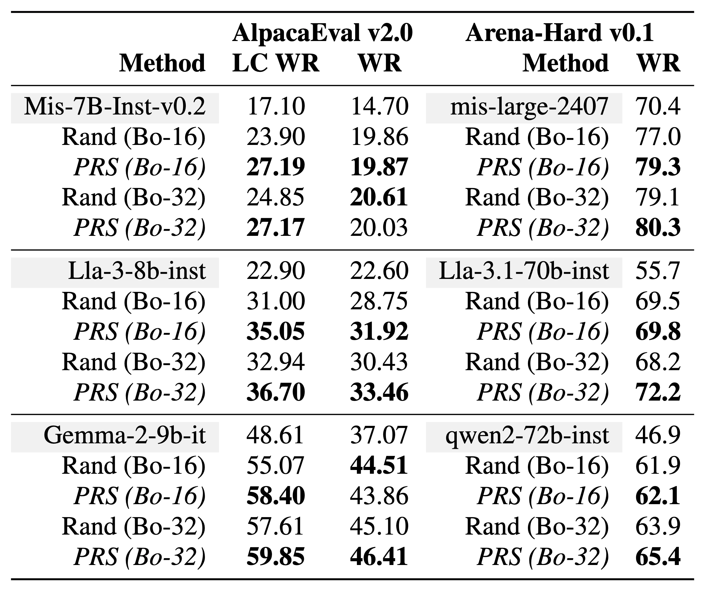

## PRS
Code for our EMNLP2024 paper [Preference Guided Reflective Sampling for Aligning Language Models](https://arxiv.org/abs/2408.12163). We provide the code for generating data with *PRS*, where the generated data can be used in iterative offline RL training for aligning a language model. For comparison, we also include the baseline sampling methods such as random sampling.

## Quick Links
  - [Background](#background)
    - [Best-of-N Sampling](#best-of-n-sampling)
    - [Repeated Random Sampling](#repeated-random-sampling)
  - [Method](#method-preference-guided-reflective-sampling-prs)
  - [Quick Start](#quick-start)
  - [Requirements](#requirements)

## Background


Iterative data generation and model re-training can effectively align large language models (LLMs) to human preferences. The process of data sampling is crucial, as it significantly influences the success of policy improvement.


### Best-of-N Sampling
Best-of-N sampling (also known as Reject sampling) is a widely used data generation method. For a given prompt, Best-of-N sampling (BoN) generates \( N \) responses from the current model and then uses a trained reward model to select the response with the highest reward for the next round of training.

### Repeated Random Sampling
In the Best-of-N setting, Random sampling (Rand) is a commonly used and straightforward sampling method. Random sampling generates \( N \) independent responses in parallel and uses temperature sampling to control diversity in the generated outputs.

Although random sampling is simple and effective, it has two main drawbacks:

1. **Low sampling efficiency**: Each response is generated independently, meaning new responses cannot learn from previous samples. This affects the quality of responses and limits improvements in sampling efficiency.
2. **Lack of preference consideration**: The goal of language model alignment is to generate responses that match user preferences, yet random sampling does not take user preferences into account during generation. As a result, the responses generated may fail to meet the diverse needs of different users."


## Method: Preference-Guided Reflective Sampling (PRS)


We propose a new sampling method named *Preference Guided Reflective Sampling (PRS)*. *PRS* adopts a tree-based generation framework that learns to adapt and adjust its outputs by reflecting on its already generated data. It can incorporate a specific user preference to optimize responses that align with it. Adjusting preferences will generate tailored responses.




Specifically, for a given prompt \( x \) and user preference \( z \), PRS enables the model \( p \) to generate \( N \) responses. PRS employs a tree structure for sampling, which can have multiple layers, each with a corresponding width. For simplicity, PRS defaults to a two-layer structure, with each layer having a width of \( \frac{N}{2} \). Additionally, PRS uses a pre-trained reward model \( R(x, z, y) \) to score the generated responses.

1. **First Layer**: Using random sampling, generate \( \frac{N}{2} \) responses, denoted as \( \mathcal{Y}_0 \), based on \( y_0 \sim p(\cdot | x, z) \).
2. Use the reward model to score each response in \( \mathcal{Y}_0 \), selecting the response with the highest reward \( y_0^* \).
3. The model then performs self-reflection based on \( y_0^* \), evaluating if \( y_0^* \) aligns with the given preference \( z \) and generating corresponding feedback \( f \).
4. **Second Layer**: Based on \( y_1 \sim p(\cdot | x, z, y_0^*, f) \), use random sampling again to generate \( \frac{N}{2} \) improved responses, denoted as \( \mathcal{Y}_1 \).
5. Score each response in \( \mathcal{Y}_1 \) using the reward model.
6. Finally, combine \( \mathcal{Y}_0 \) and \( \mathcal{Y}_1 \), returning the response with the highest reward among them.


## Result: Best-of-N Sampling on AlpacaEval v2.0 and Arena-Hard v0.1


We conducted best-of-N sampling experiments on AlpacaEval, where, for the same prompt, we used both random sampling and PRS to generate N responses, retaining the response with the highest reward score.

We tested different language models for sampling: Mistral-7b-instruct-v0.2, Mistral-large-2407, Llama-3-8b-instruct, Llama-3.1-70b-instruct, Gemma-2-9b-it, and Qwen2-72b-instruct.

We first present the baseline results of different models on AlpacaEval v2.0 and Arena-Hard v0.1. We found that sampling multiple responses and selecting the best one significantly improves model performance. Furthermore, compared to random sampling, PRS consistently shows performance gains in both best-of-16 and best-of-32 settings. This experimental result demonstrates that **PRS outperforms random sampling in best-of-N sampling.**

More results can be found in our paper.


## Quick Start
To sample responses, in file of `run_best_of_N.eval_mode.sh`, you have to specify the 

1. data path of prompts;
2. the policy model, such as Mistral-7B-Instruct-v0.2;
3. the reward model, such as [UltraRM-13b](https://huggingface.co/openbmb/UltraRM-13b). 

We provide the example data of prompts from Alpaca (see `data/alpaca_gpt4.dev_set.num=100.w_preference_by_gpt-3.5.jsonl`).

Then run:
```bash
bash run_best_of_N.eval_mode.sh
```

For *PRS*, you will get two files of responses. You can combine them with `combine_for_tree_search.py`:

```bash
python combine_for_tree_search.py path_to_initial_response path_to_refinement path_to_save
```

## Requirements

1. Install `vLLM`: We use vLLM to fasten model sampling, so you have to install vLLM from [here](https://docs.vllm.ai/en/latest/getting_started/installation.html).

